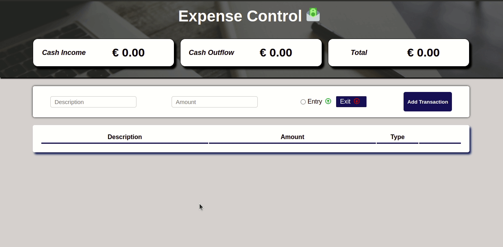
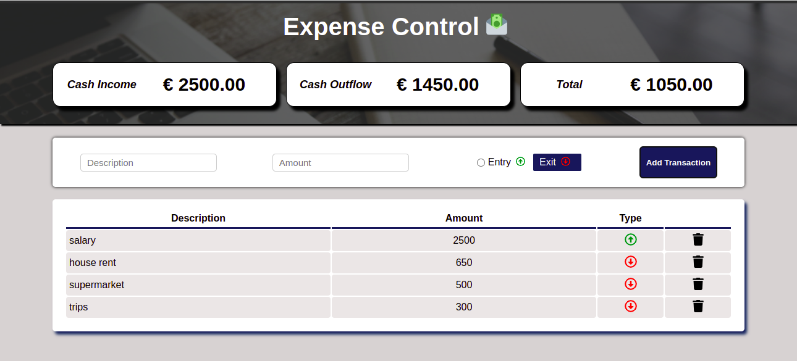

<h1 align="center">🎵 Tunes - Feel The Sound 🎵</h1>

## Deploy

click aqui: https://expense-control-mathluiz23.vercel.app/

## 💻 Projeto

Este Projeto consite em uma tabela de controle de gastos, onde você pode inserir uma descrição, valor e tipo de transação. Através das transações inseridas na tabela você tem um resumo de todos os valores de entrada, saída e o total restante entre eles.

### Ações do usuário:

Inserir descrição da transação
Inserir valor da transação
Informar se a transação é uma entrada ou saída
Poderá deletar as transações
Pode ver o resumo dos totais valores, total de entrada, saída e restante entre os dois.

## Demonstração

<div align="center">
    
</div>

## Habilidades

Neste projeto, foram utilizadas as seguintes habilidades:

- Utilizado `React`

- Utilizar os ciclos de vida de um componente React;

- Utilizar `Hook useEffect` para lidar com efeitos, neste projeto foi utilizado como componentDidUpdate, atualizando a cada transação realizada.

- Utilizar `Hook useState` para lidar com mudanças de estado da aplicação;

- Utilizar as funcionalidade `setItem e getItem` do localStorage, para adicionar, recuperar ou excluir dados localmente.

- Utilizado a biblioteca externa `Styled Componetes` para poder definir estilos baseando-se em propriedades dos componentes React.

- Utilizado a biblioteca externa `sweetalert2` para gerar alertar personalizados quando alguma informação está incorreta.

- Utilizado a biblioteca externa `react-icons` para inserir ícons que definem os tipos de transações e para deletar transações.

## Tela de pesquisa



## Rodando o projeto localmente

Clone o projeto

```bash
  git clone git@github.com:Mathluiz23/expense-control.git
```

Entre no diretório do projeto

```bash
  cd expense-control
```

Instale as dependências

```bash
  npm install
```

Inicie o projeto

```bash
  npm start
```
